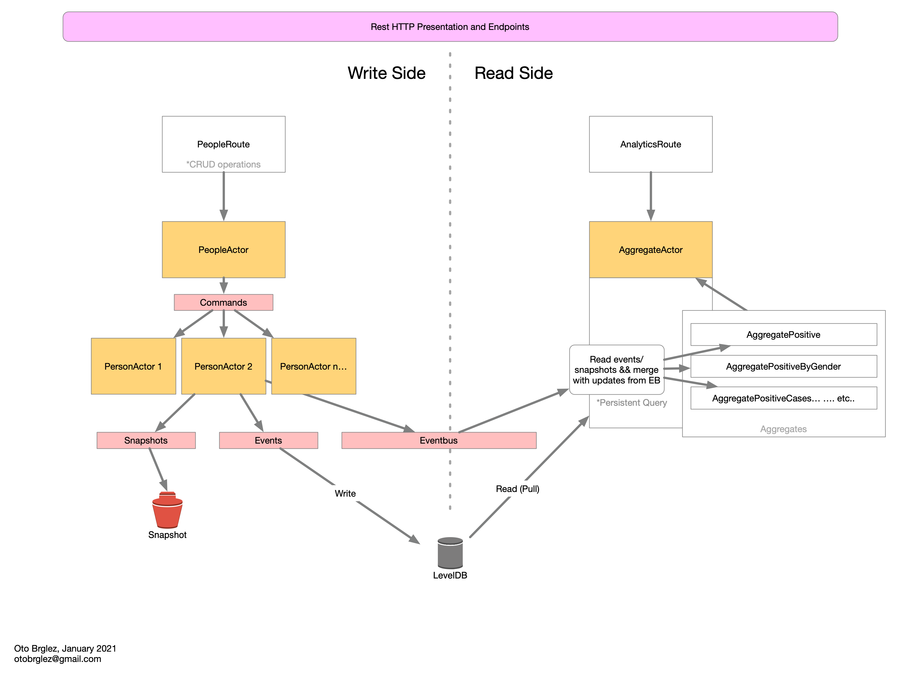

# cp-finder 🦄

Ultra-fast search and analytics engine purposely built for [Žejn GROUP](https://www.zejn.si/) - [Codemania (TL - Hack) - hackathon](https://tl-hack.incubatehub.com/p/codemania-tl-hack) in January 2021.

- Detailed competition requirements and instructions can be found in [INSTRUCTIONS.md](INSTRUCTIONS.md).
- GitHub Project Repository - [pinkstack/cp-finder](https://github.com/pinkstack/cp-finder)
- Author: [Oto Brglez, @otobrglez](https://github.com/otobrglez)

## The concept

In other to achieve incredible speed, performance, responsiveness and scalability I'm proposing that the 
system for this challenge uses the concepts of [CQRS - Command Query Responsibility Segregation][cqrs] - a 
clear separation of read and write sides of the business domain.

With this project I was aiming to address these challenges

* How to have incredibly *fast writes*?

  [Akka HTTP](https://doc.akka.io/docs/akka-http/current/index.html) framework routes request to internal `PeopleActor`; that actor then internally 
  instantly spawns new child actors. Those child actors then have enough time to process request (in for of commands)
  before they are written to [LevelDB](https://github.com/google/leveldb) storage.
  
* How to have incredibly *fast updates*?

  `PeopleActor` keeps `N` number of live persistent `PersonActor`s alive; so any update, change or delete 
  will hit the live actor or will spawn new one to process the designated command. `PersonActor` is domain
  actor that represents one core entity of the system.
  
* How to have fast endpoints for *analytics*?

  `AggregateActor` is another actor that represents effectively the "read side". 
  Internally it runs ["Persistence Query"](https://doc.akka.io/docs/akka/current/persistence-query.html), a query that pulls events/snapshots from LevelDB storage
  and in parallel generates "aggregates" for the user to consume. 
  These aggregates are then constantly updated with changes from "write side" as they can be life feed updates.
  So; whenever user is fetching statistics on these analytical endpoints he is reading "in-memory" representation.

* Trade-offs. In other to achieve these incredible results some trade-offs needed to be made.  There is a delay between the time that user writes on "write" side and to "analytics" side to represent that change. The system follows the so called patterns of ["eventual consistency"](https://en.wikipedia.org/wiki/Eventual_consistency) and [event sourcing](https://martinfowler.com/eaaDev/EventSourcing.html).



### Benchmarks ⚡️

Although in the real-world these test would be executed with something like [Gatling](https://gatling.io/)
to stress test the whole application. I've resulted to `curl` to get some measurements after the system
has already loaded the whole test CSV file (11000 records).

Creating a person with `POST` on `/people` endpoint:

```bash
curl --header "Content-Type: application/json" \
  --request POST \
  --data '{"id":"11000","gender":"M","birthDate":"23.06.1953","isoCountry":"gb","testDate":"1.03.2021","testResult":"P","intervention":"quarantine"}' \
  -w "@curl-format.txt" \
  -o /dev/null \
  -s http://localhost:8080/people
```
```
     time_namelookup:  0.011883s
        time_connect:  0.012124s
     time_appconnect:  0.000000s
    time_pretransfer:  0.012156s
       time_redirect:  0.000000s
  time_starttransfer:  0.000000s
                     ----------
          time_total:  0.017672s
```

Fetching the person with `GET`:

```bash
curl --header "Content-Type: application/json" \
  -w "@curl-format.txt" \
  -o /dev/null \
  -s http://localhost:8080/people/11006
```

```
     time_namelookup:  0.004118s
        time_connect:  0.004303s
     time_appconnect:  0.000000s
    time_pretransfer:  0.004331s
       time_redirect:  0.000000s
  time_starttransfer:  0.005596s
                     ----------
          time_total:  0.005677s
```

The `PATCH` used to update a person via `id` and `JSON` payload

```bash
curl --header "Content-Type: application/json" \
  --request PATCH \
  --data '{"gender":"F","birthDate":"23.06.1953","isoCountry":"gb","testDate":"1.03.2021","testResult":"P","intervention":"quarantine"}' \
  -w "@curl-format.txt" \
  -o /dev/null \
  -s http://localhost:8080/people/11006
```

```
     time_namelookup:  0.004437s
        time_connect:  0.004721s
     time_appconnect:  0.000000s
    time_pretransfer:  0.004759s
       time_redirect:  0.000000s
  time_starttransfer:  0.000000s
                     ----------
          time_total:  0.006930s
```

... and now the **impressive** part, numbers and stats endpoints...

- `GET /analytics/positiveByDates` - all positive cases, grouped by date.

  ```
     time_namelookup:  0.004067s
        time_connect:  0.004297s
     time_appconnect:  0.000000s
    time_pretransfer:  0.004332s
       time_redirect:  0.000000s
  time_starttransfer:  0.006747s
                     ----------
          time_total:  0.006836s
  ```

- `GET /analytics/positiveByGenderAndState` - positive cases grouped by the gender and "state"

  ```
     time_namelookup:  0.004433s
        time_connect:  0.004663s
     time_appconnect:  0.000000s
    time_pretransfer:  0.004700s
       time_redirect:  0.000000s
  time_starttransfer:  0.006081s
                     ----------
          time_total:  0.006171s
  ```

- `GET /analytics/quarantine` - number of cases, grouped by country and counted by number of time-left in quarantine.

  ```
     time_namelookup:  0.004133s
        time_connect:  0.004374s
     time_appconnect:  0.000000s
    time_pretransfer:  0.004409s
       time_redirect:  0.000000s
  time_starttransfer:  0.005778s
                     ----------
          time_total:  0.005875s
  ```

Fast,... 🐇

[cqrs]: https://martinfowler.com/bliki/CQRS.html

## Usage 🚀

### Requirements

The service can run as `fat JAR` on top of any modern JVM or via pre-packaged Docker Image.

> 🐇 Although out of the scope of the assigment; this project can easily be compiled with GraalVM to
> also run as "native-image"; that would further reduce memory footprint and
> improve boot-up time and possibly performance.

## Development 🏗

### Requirements

- Install any modern JDK, although it is suggested to use [SDKMAN](https://sdkman.io/) with OpenJDK (14).

    - Development was done on `openjdk version "14.0.2" 2020-07-14`

- [Install Scala](https://docs.scala-lang.org/getting-started/index.html) with
  [Scala Built Tool (SBT)](https://www.scala-sbt.org/download.html)

    - Scala version used `2.13.4`
    - SBT version used `1.4.6`

### Running 🏃‍

To run the server please use the following SBT commands, that will spawn the server
on [http://127.0.0.1:8080](http://127.0.0.1:8080) and put **everything online**.

```bash
$ sbt run
```

### Compilation

To compile the project into `fat JAR` invoke `assembly` task

```bash
$ sbt assembly
```

The assembly task will compile everything and build a jar that can be invoked like so from the root of the project

```bash
$ java -jar cp-finder.jar
```

The servers also supports the following environment variables that can be interchangeably

- `PORT=8080` - HTTP port where the service will listen to.
- `JOURNAL_LEVELDB_DIR=tmp/journal` - File path for LevelDB embedded storage directory.
- `SNAPSHOT_DIR=tmp/snapshots` - File path for snapshots storage directory

They can also be passed prior to Java command invocation i.e.:

```bash
$ PORT=3030 java -jar cp-finder.jar
```

### Testsuite

To run the full testsuite including integration tests please run

```bash
$ sbt test
```

### Tooling 🛠

To populate the service with seed data from CSV - the script [bin/feed-csv.rb](bin/feed-csv.rb) can be used like so:

```bash
./bin/feed-csv.rb data/covidPeople.csv
```

### REST API

#### CRUD 🚜

##### Creating a person

```http request
POST http://127.0.0.1:8080/people
Content-Type: application/json

{
  "id": 42,
  "gender": "M",
  "isoCountry": "svn",
  "testResult": "P",
  "intervention": "quarantine",
  "birthDate": "23.06.1953",
  "testDate": "31.12.2020"
}
```

##### Reading a person

```http request
GET http://127.0.0.1:8080/people/42
```

##### Updating a person

```http request
PATCH http://127.0.0.1:8080/people/42
Content-Type: application/json

{
  "gender": "M",
  "isoCountry": "svn",
  "testResult": "N",
  "intervention": "quarantine",
  "birthDate": "23.06.1953",
  "testDate": "31.12.2020"
}
```

##### Deleting a person

```http request
DELETE http://127.0.0.1:8080/people/42
```

#### Analytics 📈

##### Number of positive test cases

```http request
GET http://127.0.0.1:8080/analytics/positive
```

```json
{
  "count": 5457
}
```

##### Number positive cases grouped by gender

```http request
GET http://127.0.0.1:8080/analytics/positiveByGender
```

```json
{
  "female": 2779,
  "male": 2678
}
```

##### Number of positive test cases grouped by the gender, and their current state (quarantine, medical care, hospitalized)

```http request
GET http://127.0.0.1:8080/analytics/positiveByGenderAndState
```

```json
{
  "female": {
    "hospitalized": 919,
    "medical care": 865,
    "quarantine": 995
  },
  "male": {
    "hospitalized": 898,
    "medical care": 916,
    "quarantine": 864
  }
}
```

##### Number of positive cases by date for all data

```http request
GET http://127.0.0.1:8080/analytics/positiveByDates
```

```json
{
  "dates": {
    "8.12.2020": 20,
    "9.01.2021": 12,
    "9.03.2020": 14,
    "9.04.2020": 18,
    "9.05.2020": 20,
    "9.06.2020": 14,
    "9.07.2020": 15,
    "9.08.2020": 14,
    "9.09.2020": 16,
    "9.10.2020": 19,
    "9.11.2020": 12,
    "9.12.2020": 14
    ...
```

##### Number of positive cases by date\*

This endpoint is to be used for following requirements:

- The number of positive cases by date for all data.
- Filtering subset of countries and return the number of total cases for all the countries
- Endpoint groups results per country

```http request
GET http://127.0.0.1:8080/analytics/positiveByCountryAndDates
```

```json
{
  "countries": {
    "aus": {
      "1.03.2020": 3,
      "2.03.2020": 3,
      "3.03.2020": 3,
      "4.03.2020": 9,
      "5.03.2020": 5,
      "6.03.2020": 2,
      "7.03.2020": 9,
      "8.03.2020": 4,
      "9.03.2020": 2,
      "10.03.2020": 6,
      "11.03.2020": 5,
      "12.03.2020": 6,
      "13.03.2020": 1,
      ...
```

###### Number of individuals currently in the quarantine

This endpoint is to be used for following requirements:

- The number of individuals currently in the quarantine.
- Results are grouped by country
- Filtering is set to only show cases that are quarantined
- Time of quarantine is set to 14 days.
- The response is "live" and changes as time passes by...

With the help of `country` query parameters the results can be further filtered.

```http request
GET http://127.0.0.1:8080/analytics/quarantine
```

```json
{
  "countries": {
    "aus": {
      "0": 3,
      "1": 2,
      "2": 1,
      "3": 2,
      "4": 3,
      "5": 1,
      "6": 1,
      "7": 3,
      "8": 1,
      ...
  }
}
```

## Author

- [Oto Brglez](https://github.com/otobrglez) / [@otobrglez](https://twitter.com/otobrglez)
